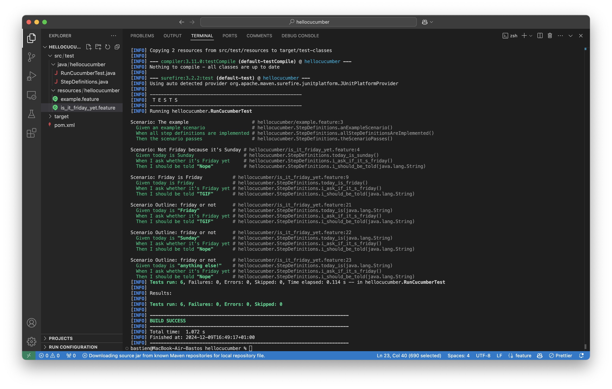
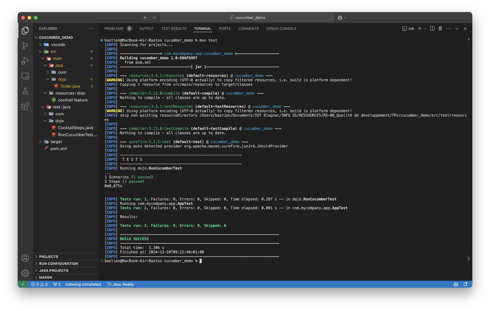
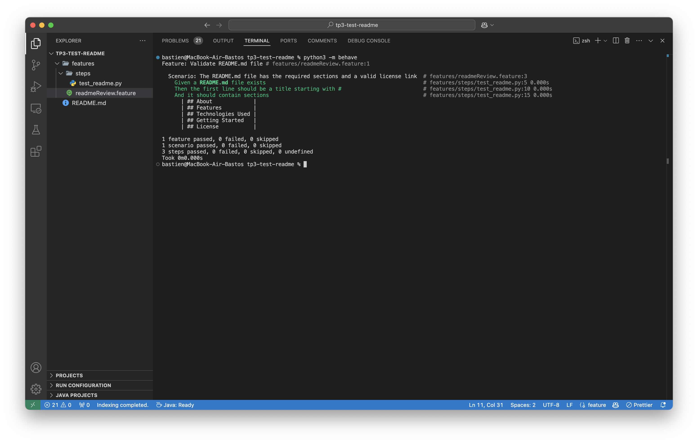

= R5.A.08 -- Dépôt pour les TPs
:icons: font
:MoSCoW: https://fr.wikipedia.org/wiki/M%C3%A9thode_MoSCoW[MoSCoW]

Ce dépôt concerne les rendus de mailto:bastien.record@etu.univ-tlse2.fr[Bastien Record].

== TP1

[source,gherkin]
----
Feature: Is it friday ?
    I want to know if it's Friday
    Scenario: Not Friday because it's Sunday
        Given today is Sunday
        When I ask whether it's Friday yet
        Then I should be told "Nope"
    Scenario: Friday is Friday
        Given today is Friday
        When I ask whether it's Friday yet
        Then I should be told "TGIF"
    Scenario Outline: friday or not
        Given today is "<day>"
        When I ask whether it's Friday yet
        Then I should be told "<answer>"
        Examples:
            | day            | answer |
            | Friday         | TGIF   |
            | Sunday         | Nope   |
            | anything else! | Nope   |
----

== TP2

[source,java]
----
package dojo;

import java.util.ArrayList;
import java.util.List;

class Order {

    private String owner;
    private String target;
    private List<String> cocktails;

    public Order() {
        this.cocktails = new ArrayList<>();
    }

    void declareOwner(String romeo) {
        this.owner = romeo;
    }

    void declareTarget(String juliette) {
        this.target = juliette;
    }

    List<String> getCocktails() {
        return this.cocktails;
    }

}
----

== TP3

[source,gherkin]
----
Feature: Validate README.md file

  Scenario: The README.md file has the required sections and a valid license link
    Given a README.md file exists
    Then the first line should be a title starting with #
    And it should contain sections
      | ## About             |
      | ## Features          |
      | ## Technologies Used |
      | ## Getting Started   |
      | ## License           |
----

[source,python]
----
import os
import re
from behave import given, then

@given('a {string} file exists')
def step_readme_exists(context, string):
    with open(string, "r", encoding="utf-8") as file:
        context.lines = file.readlines()

@then('the first line should be a title starting with #')
def step_first_line_title(context):
    assert len(context.lines) > 0, "This file is empty"
    assert context.lines[0].startswith("#"), "First line does not start with #"

@then('it should contain sections')
def step_check_sections(context):
    sections = [row[0] for row in context.table]
    content = "".join(context.lines)
    for section in sections:
        assert section in content, f"Section not found: {section}"
----

L'objectif est de tester si le README.md respect ma template habituelle pour mes projets perso.

== TP3

Rapport du TP2 avec cukedoctor : https://github.com/IUT-Blagnac/r5-a-08-qualdev-bastos-rcd/blob/main/cucumber_demo/target/cukedoctor/documentation.html

Rapport du TP3 avec cukedoctor :
[source]
----
include::tp3-test-readme/documentation.adoc[]
----